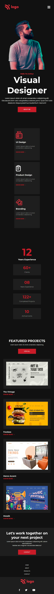
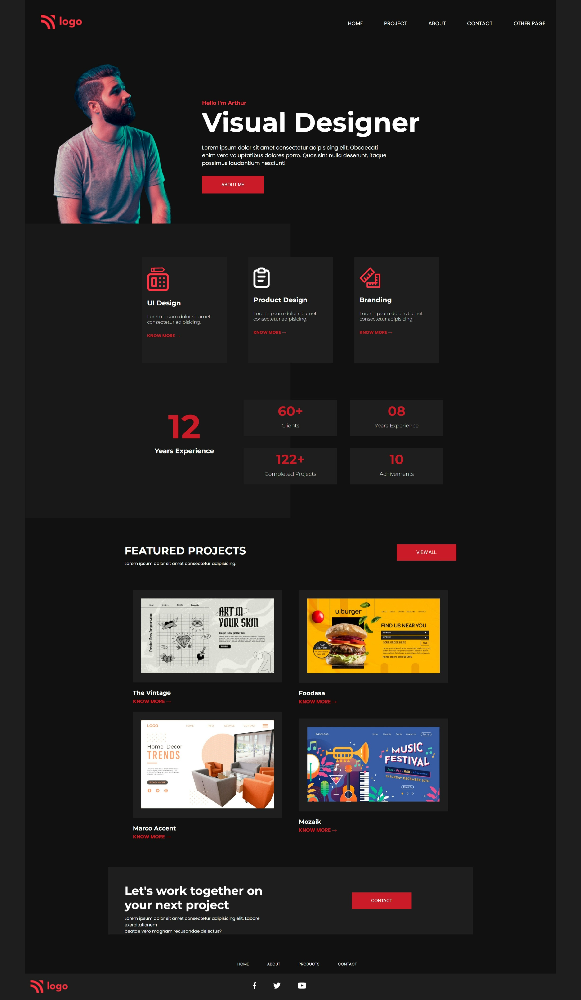

# 
**Project 15 - Product Design Landing Page**

> ## Topics learnt in this project
- Justify / Align items in complex / nested  structure
- use of display border for component in * section for posioning reference
   

> ## Time to complete this project 
> # **7 Hrs**

## **By : Kalpesh K Dhotre**
 

## [🌏 Deployed link](https://kd-project-15.netlify.app/)

 

## Below is screenshot of Mobile View & [Click here large screen view.](#large-screen-view)

 

 

# Large Screen View

 

## 
 [Back to top](#centerproject-15---product-design-landing-pagecenter)
